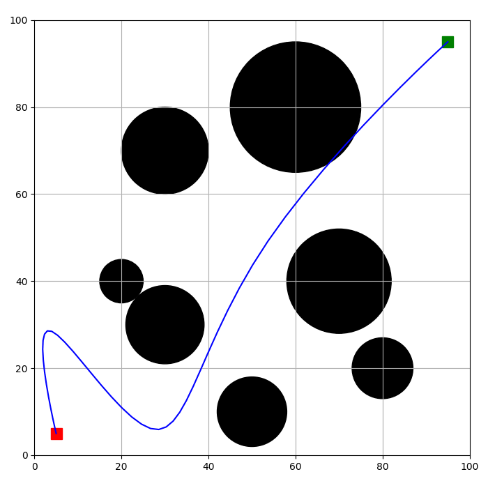

# Path Planning and Obstacle Avoidance Using PSO in Python

This is an open-source project developed in Python for Mobile Robot Path Planning and Obstacle Avoidance. The package offers a framework for solving the path planning problem using Particle Swarm Optimization (PSO). The user can define the environment and obstacles and then use PSO to obtain the optimal path. The resulting path is a spline smooth curve, which is then evaluated using a penalty function. If the path curve violates some constraints, it will be penalized. These constraints are:

- The robot must remain inside the environment.
- The robot must not collide with obstacles.
- The robot must end up at the goal point.

## Path Planning and Spline Curves
Path planning is the task of finding a path from a starting point to a goal point in a given environment. In the context of mobile robots, the path must also take into account the presence of obstacles. Spline curves are widely used in path planning because they offer a smooth and continuous curve that can be used to guide the robot's motion.

## Particle Swarm Optimization
Particle Swarm Optimization (PSO) is a population-based optimization algorithm inspired by the collective behavior of birds flocking or fish schooling. In PSO, a group of particles moves in a search space, trying to find the optimal solution by updating their position and velocity according to their own experience and the experience of their neighbors. PSO is a popular choice for path planning because it can handle non-linear and non-convex optimization problems.

## Penalty Function
A penalty function is a function that adds a penalty to the objective function when certain constraints are violated. In the context of path planning, the penalty function is used to ensure that the path satisfies the constraints mentioned above. If the path violates any of these constraints, the penalty function will add a penalty to the objective function, making the solution less favorable. In this project, a multiplicative penalty term is added the original cost function.

## Usage Guide

First import the `path_planning` modulde.

```python
import path_planning as pp
```

Then create an instance of Environment class.

```python
env_params = {
    'width': 100,
    'height': 100,
    'robot_radius': 1,
    'start': [5,5],
    'goal': [95,95],
}

env = pp.Environment(**env_params)
```

Now, add obstacles to the environment.

```python
obstacles = [
    {'center': [20, 40], 'radius': 5},
    {'center': [30, 30], 'radius': 9},
    {'center': [30, 70], 'radius': 10},
    {'center': [50, 10], 'radius': 8},
    {'center': [60, 80], 'radius': 15},
    {'center': [70, 40], 'radius': 12},
    {'center': [80, 20], 'radius': 7},
]

for obs in obstacles:
    env.add_obstacle(pp.Obstacle(**obs))
```

Now, you define the cost function by calling `EnvCostFunction` function. Here it is assumed that we have 3 control points and the algorithm renders the path using 50 points. This is called the resolution of the path.

```python
# Number of Control Inputs
num_control_points = 3

# Resolution of the Path Curve (number of points to render the path)
resolution = 50

cost_function = pp.EnvCostFunction(env, num_control_points, resolution)
```

Now, you can define the optimization problem, as follows.

```python
problem = {
    'num_var': 2*num_control_points,
    'var_min': 0,
    'var_max': 1,
    'cost_function': cost_function,
}
```

Finally, you can solve the problem using PSO.

```python
pso_params = {
    'max_iter': 100,
    'pop_size': 100,
    'c1': 2,
    'c2': 1,
    'w': 0.8,
    'wdamp': 1,
    'resetting': 25,
}
bestsol, pop = PSO(problem, **pso_params)
```

The `bestsol` variable contains the best solution found by the algorithm. The `pop` variable contains the population of particles at the end of the optimization process. You can use 

## A Sample Output

The following animation shows how PSO searches for the optimal path and how the solution evolves while the optimization algorithms runs.

<p align="center">
    
</p>

## How to Cite

Feel free to use this code in your research, but please remember to properly cite the code as follows:

Kalami Heris, Mostapha (2023). Python Implementation of Path Planning and Obstacle Avoidance using PSO [Computer software]. Retrieved from https://github.com/smkalami/path-planning

By citing the code accurately, you give credit to the original author and ensure that your research is transparent and reproducible. Thank you for acknowledging the source of the code.
